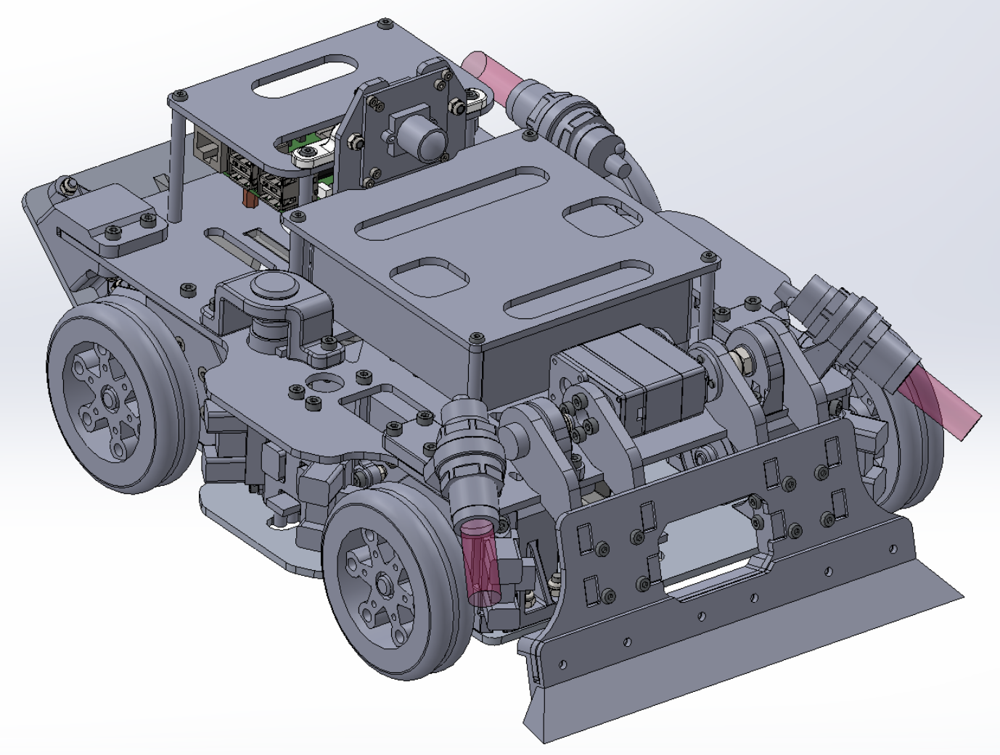

# 🤖 [项目名称] - 轮式格斗小车开源项目

> 这是一个基于 STM32 + 树莓派的 3.5kg 轮式格斗机器人项目。所有机械结构现已开源，旨在为参赛者和格斗机器人爱好者提供参考与交流。

## 📥 模型下载 (Download)

由于 SolidWorks 工程文件体积较大，我们将源文件托管在网盘中，GitHub 仅作为文档和 BOM 表的维护平台。

- **下载链接**：[百度网盘](https://pan.baidu.com/s/1T4pkdNaI4oGYY3aX2SX6jA)
- **提取码**：`2233`
- **文件包含**：
    - 完整装配体源文件 (**SolidWorks 2023**)
    - 通用格式文件 (`.STEP`) 用于旧版本或其他软件查看
- **⚠️ 注意**：源文件使用 **SolidWorks 2023** 设计，低版本软件无法直接打开 SLDPRT/SLDASM 文件，请使用 STEP 格式或升级软件。

## ⚙️ 技术规格 (Specifications)

- **量级**：约 3500g (3.5kg级)
- **整机尺寸**：290 × 230 × 145 mm
- **设计软件**：SolidWorks 2023
- **动力系统**：
    - **驱动**：4WD 差速转向，JGB37-3625 无刷直流减速电机 (24V) × 4
    - **武器**：15kg 双轴舵机驱动的铲齿结构
    - **电池**：祺索 24V 12A 锂电池组
- **感知系统 (Sensors)**：
    - **灰度传感器** × 4 (识别擂台灰度值)
    - **红外测距** × 6~12 (识别围栏、台阶、能量块及对手)
    - **光电开关** × 3 (边缘检测 × 2 + 擂台下朝向检测 × 1)
    - **IMU**：角度传感器 (检测)

## 🛠️ 物料清单 (BOM)

### 核心电子件
| 部件 | 型号/规格 | 备注 |
| :--- | :--- | :--- |
| **上位机** | Raspberry Pi 5 | 负责视觉与决策 |
| **下位机** | STM32H743VGT5 | 负责运动控制 |
| **驱动电机** | JGB37-3625 (24V) | 无刷减速电机 |
| **武器舵机** | 15kg 双轴数字舵机 | - |

### 结构材料
* **底板**：钣金折弯加工
* **机身板材**：FR-4 玻纤板 (高强度，绝缘)
* **3D 打印件**：PLA 材料 (建议升级为 PLA+ 或 PETG 以提高耐冲击性)

> 📋 完整 Excel 版 BOM 表及购买链接请在仓库的 `/bom` 目录下查看。

## 🔧 制造与组装建议

1.  **材料选择**：原机使用了 PLA 打印，实战中强度可能不足。建议有条件的使用 **尼龙 (Nylon)** 烧结或 **PETG** 打印核心受力件。
2.  **外包加工**：钣金和玻纤板建议直接导出 CAD 图纸找淘宝商家加工，精度更有保障。
3.  **组装建议**：
    * 受力较大的螺丝（如电机座、武器轴）**建议使用中强度螺丝胶 (蓝色)**，防止震动脱落。
    * **按照装配图顺序**，否则可能出现装了外壳锁不到里面螺丝的尴尬情况。
    * **预留线槽**：内部走线较为密集，组装时请务必使用扎带理线，防止磨损。

## ⚠️ 迭代与优化 (Known Issues & Optimization)

**本项目为第一代原型机 (V1.0)，在实战和调试中发现以下问题，复刻时请务必注意优化：**

1.  **转向困难**：由于采用高摩擦力轮子，转向时阻力极大。
2.  **电机耐用性**：原配电机轴在撞击下容易松动/断裂（比赛期间损坏 2 个）。
3.  **维修困难**：未充分考虑快速维修，更换电池或电机需要拆卸大量螺丝和排线。
4.  **安装空间**：部分位置扳手无法伸入。
5.  **电池固定**：缺少专用的电池绑带孔位。

## 🛑 安全警告

* 格斗机器人具有一定的危险性，调试电机和武器时请**注意自身安全**。
* 作者不对因组装、修改或使用本项目造成的任何财产损失或人身伤害负责。

## 📜 开源协议

本项目采用 **CC BY-SA 4.0** 协议开源。
你可以自由修改和分发，但必须保留原作者署名，且修改后的作品必须以相同协议开源。

## 📬 交流与反馈

如果你对结构有改进意见，欢迎提交 Pull Request 或 Issues！

- **B站**：[mcal](https://space.bilibili.com/693733860)
- **邮箱**：1905360479@qq.com